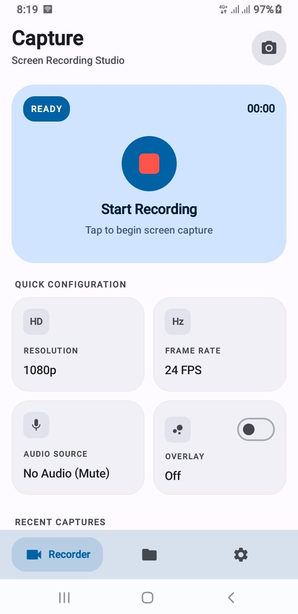

# 🎬 Screen Recorder & Editor for Android

[](https://kotlinlang.org)
[](https://developer.android.com/jetpack/compose)
[](https://developer.android.com)
[](https://developer.android.com)
[](https://developer.android.com/media/media3)

A modern, simple, high performance, and feature rich Android Screen Recording application built with **Kotlin**, **Jetpack Compose (Material 3)**, **MediaProjection API**, **OpenGL ES**, and **AndroidX Media3**.

Designed with a sleek Bento grid aesthetic, it delivers ultra smooth 60fps/120fps recording, custom selective area capture, floating bubble overlay controls, and a built in timeline video editor.

---

## 🎬 App Demo

<p align="center">
  <a href="https://youtube.com/shorts/SvzqgWOXV6I">
    
  </a>
</p>
*Click the screenshot above to watch the app in action on YouTube.*

---

## 🤖 About This Project

This project was built with roughly **80% AI assisted development** and **20% manual work** covering architecture decisions, debugging (especially the OpenGL/EGL capture pipeline), UI refinement, and testing. AI tools were used as a development accelerator; the core logic, structure, and final polish were reviewed and finalized manually.

> ⚠️ **Note:** This app was built primarily for **personal use** and has been tested and confirmed working perfectly on the developer's own device. Since Android fragmentation means OEMs handle `MediaProjection`, hardware encoders, and overlay permissions differently, you **may encounter issues on certain specific devices or Android versions**. Feel free to fork, customize, and adapt the code to fit your own use case, commercial or personal.

---

## ✨ Features

### 🎥 Screen Recording Engine
- **Full Screen Recording:** High fidelity screen capture using Android's native `MediaProjection` and `MediaRecorder` pipeline.
- **Selective Custom Area Recording:** Drag and resize region selector allowing you to record only a specific portion of your screen powered by real time **OpenGL ES (EGL)** surface cropping.
- **High Frame Rates & High Resolutions:** Supports 480p (SD), 720p (HD), 1080p (FHD), 4K (UHD) and Native screen resolution with configurable framerates from 24 FPS up to 60 FPS.
- **Hardware Encoders:** Select between standard **H.264 (AVC)** or high efficiency **H.265 (HEVC)** codecs with custom bitrates (2 Mbps to 50 Mbps).
- **Flexible Audio Options:**
    - Microphone audio recording
    - Internal device audio (Android 10+)
    - Mixed (Mic + Internal) audio
    - Mute / Silent mode

### 🎛️ Floating Controls & Quick Access
- **Floating Overlay Bubble:** Draggable floating bubble for quick pause, resume, stop, and screenshot capture without leaving your current app.
- **Quick Settings Tile:** Start or stop recording directly from your Android notification drawer / Quick Settings panel.
- **Smart Countdown:** Configurable preparation countdown timer (Instant, 3s, 5s, 10s) with live UI feedback.
- **Shake to Stop:** Stop recording easily by shaking your device.

### ✂️ Built-in Video Editor & Player
- **Precision Trimming & Splitting:** Cut beginning/end segments or extract specific clips with frame-accurate timeline scrubbing.
- **Speed Adjustment:** Adjust playback speed from 0.25x slow motion up to 3.0x fast forward.
- **Selective Region Blur:** Protect privacy by blurring sensitive areas (passwords, emails, faces) directly onto the video canvas before exporting.
- **Video Transformation:** Rotate, crop aspect ratios, mute/unmute audio tracks, and re-encode using **AndroidX Media3 Transformer**.
- **Integrated Video Player:** Powered by **Media3** with gesture controls, playback speed toggles, and metadata inspection.

### 📂 Library & Media Management
- **Local Persistence:** Room Database cache with MediaStore synchronization.
- **Instant Sharing & Export:** Quick-share videos and screenshots to external apps, messaging platforms, or cloud storage.
- **Detailed File Info:** View resolution, bitrate, audio profile, duration, and file size at a glance.

---

## 🏗️ Architecture & Tech Stack

The project follows modern Android architecture guidelines (MVVM + Clean Architecture) with unidirectional data flow (UDF).

```
app/src/main/java/com/example/
├── data/
│   ├── local/              # Room Database, DataStore Preferences, DAOs
│   ├── model/              # Domain models (RecordingSettings, VideoItem, etc.)
│   └── repository/         # Repository implementation & MediaStore handlers
├── service/
│   ├── ScreenRecordService.kt            # Core foreground service managing MediaProjection
│   ├── FloatingOverlayService.kt         # Draggable floating bubble overlay
│   ├── SelectiveAreaOverlayService.kt   # Dynamic screen crop selection window
│   └── RecordTileService.kt              # Android Quick Settings tile integration
├── ui/
│   ├── components/         # Reusable Compose UI (Editor, Player, Bento Cards, Overlays)
│   ├── screens/            # Home, Library, and Settings screens
│   ├── theme/              # Material 3 Color Schemes, Typography, Shapes
│   └── MainViewModel.kt    # Main state holder coordinating UI and background services
└── util/
    ├── GlCropHelper.kt     # OpenGL ES EGL pipeline for selective area cropping
    ├── VideoEditUtils.kt   # Media3 Transformer video editing pipeline
    ├── AreaBlurEffect.kt   # Custom shader / canvas blur processing
    └── NotificationHelper.kt # Foreground service notifications & channels
```

### Key Libraries & Technologies:
- **UI:** Jetpack Compose, Material 3, Material Icons Extended
- **Asynchronous / Reactive:** Kotlin Coroutines, StateFlow, SharedFlow
- **Media & Processing:**
    - Android `MediaProjection`, `VirtualDisplay`, `MediaRecorder`
    - AndroidX Media3 (`media3-transformer`, `media3-effect`)
    - OpenGL ES 2.0 / EGL for real-time video buffer cropping
- **Storage & State:**
    - AndroidX DataStore Preferences (Instant settings persistence)
    - Room Database (Local metadata storage)
    - Android MediaStore API (Scoped storage compliant)
- **Image Loading:** Coil Compose
- **Permissions:** Accompanist Permissions

---

## 📱 Getting Started

### Prerequisites
- **Android Studio** Ladybug (2024.2.1) or newer
- **JDK 11** or **JDK 17**
- Android device or emulator running **Android 7.0 (API Level 24)** or higher (Physical device recommended)

### Installation & Build

1. **Clone the Repository:**
   ```bash
   git clone https://github.com/alsaeeddev/android-screen-recorder-editor-jetpack-compose.git
   cd screen-recorder-android
   ```

2. **Open in Android Studio:**
    - Open Android Studio, select **Open**, and navigate to the cloned project folder.
    - Wait for Gradle sync to complete.

3. **Build and Run:**
    - Connect your Android device via USB (with USB Debugging enabled) or start an Android Emulator.
    - Click **Run 'app'** (`Shift + F10`) or run via command line:
   ```bash
   ./gradlew assembleDebug
   ```

---

## 🔒 Permissions & Privacy

This application is strictly offline and respects user privacy. No telemetry, recordings, or personal data are ever uploaded to external servers.

| Permission | Purpose |
| :--- | :--- |
| `FOREGROUND_SERVICE_MEDIA_PROJECTION` | Required to capture screen content in the background |
| `RECORD_AUDIO` | Optional: To record microphone commentary |
| `SYSTEM_ALERT_WINDOW` | Optional: To display the floating control bubble and area crop selector |
| `POST_NOTIFICATIONS` | Required on Android 13+ for foreground service notifications |
| `READ_MEDIA_VIDEO` / `READ_MEDIA_IMAGES` | To display and manage recordings in your local library |

---

## 📄 License

This project is open-source and licensed under the **Apache License 2.0** see the [LICENSE](LICENSE) file for details. You are free to use, modify, and distribute this project, provided the original license and copyright notice are retained.

---

## 👨‍💻 Developer

Built and maintained by **[Al Saeed Dev](https://alsaeeddev.com/)** freelance Android native & Flutter developer specializing in production ready mobile apps, custom UI/UX, and end-to-end app development.

📩 **For freelance projects, custom app development, or collaboration:**
- 🌐 Website: [alsaeeddev.com](https://alsaeeddev.com/)
- 📧 Email: alsaeeddev@gmail.com
- 📸 Instagram: [@alsaeeddev](https://instagram.com/alsaeeddev)

If you're looking to build a custom Android native or Flutter application from MVP to full production, feel free to reach out. Available for freelance projects, app maintenance, white label help and long term collaboration.
